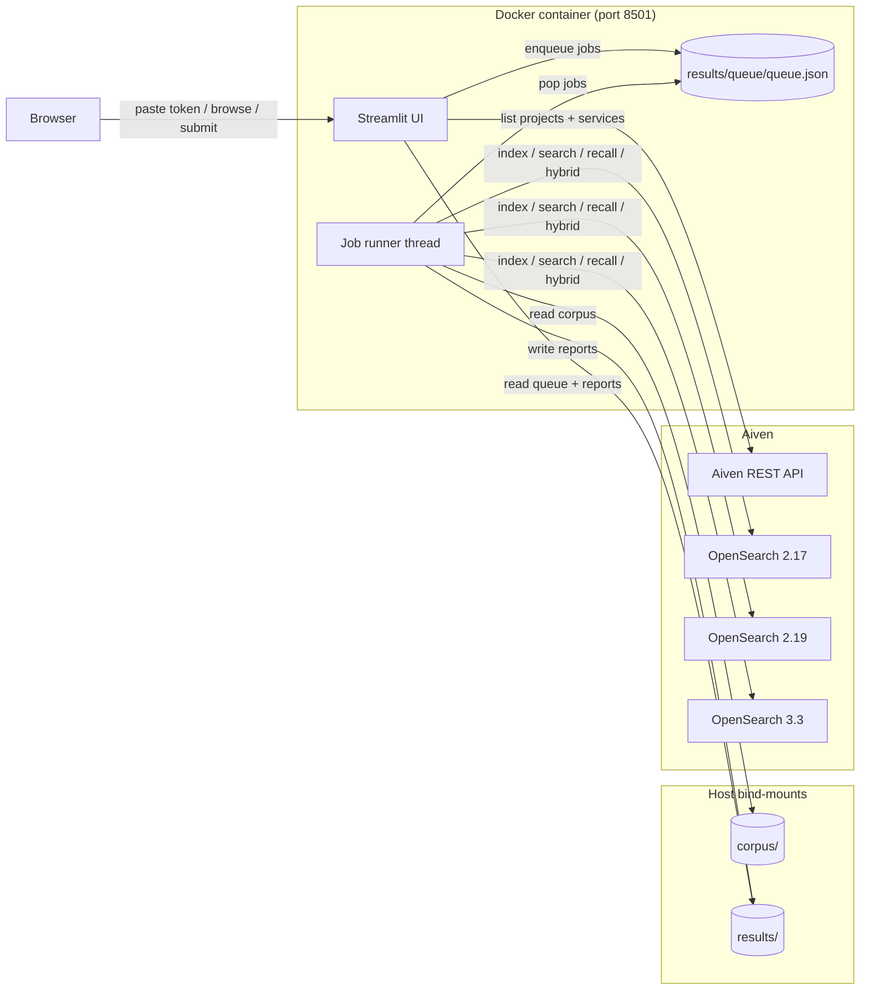

## OpenSearch k-NN version comparison benchmark

A self-contained benchmarking tool for comparing k-NN vector search across OpenSearch versions and engine configurations. Run it as a single Docker container — a Streamlit UI lets you log in to Aiven, pick your existing OpenSearch services, build a test matrix, and watch jobs execute with live results.

The educational goal is the same as Part 1: the code teaches you how to think about indexing throughput, query latency, recall accuracy, memory footprint, and the trade-offs introduced by different engines, quantization modes, and index configurations — not just to give you a number.

---

## Architecture



The Aiven token never touches disk — it lives in `st.session_state` for the browser session only. The corpus and results directories are bind-mounted from the host so a container restart loses no data.

---

## How the corpus works

Every measurement command loads documents and queries from a **pre-built corpus on disk**. The corpus is created once by `bench-build-corpus`, which samples real text from public IR datasets and embeds each text **once** using a local [sentence-transformers](https://sbert.net) model (default: `nomic-ai/nomic-embed-text-v1.5`, 768-dim). Model weights are downloaded on first run (~270 MB) and cached; subsequent runs are fully offline.

Benchmarks Matryoshka-truncate the stored embedding to the requested `--embed-dim` (256, 512, or 768), L2-renormalize, and send the vectors to OpenSearch.

Timing numbers reflect Aiven OpenSearch and your network round-trip — local embedding throughput is never in the picture during measurement.

| Source        | What it provides                                     |
| ------------- | ---------------------------------------------------- |
| MS MARCO      | Real Bing search queries + web passages              |
| BeIR/quora    | Duplicate-question detection corpus + queries        |
| BeIR/fiqa     | Financial Q&A from StackExchange                     |
| BeIR/scifact  | Scientific claim verification (small but realistic)  |

The default `--dataset mixed` preset draws ~25 % from each, with deficits rolled over to MS MARCO so the target counts are always achievable.

---

## Benchmark types

| Command              | Status      | What it measures                                        |
| -------------------- | ----------- | ------------------------------------------------------- |
| `bench-build-corpus` | implemented | One-time: real text + local HF embeddings (768-dim)     |
| `bench-build-groundtruth` | implemented | One-time: brute-force top-100 nearest neighbours   |
| `bench-index`        | implemented | Bulk ingestion throughput at varying batch sizes         |
| `bench-search`       | implemented | k-NN query latency over multiple rounds                  |
| `bench-recall`       | implemented | recall@1/5/10/50/100 vs ground truth alongside latency  |
| `bench-hybrid`       | implemented | BM25 + k-NN hybrid query with optional metadata filter  |
| `bench-recover`      | implemented | Cold-start cost after auto-pause (free tier)            |
| `bench-plan-change`  | implemented | Upgrade / downgrade impact while live (CLI only)        |

### k-NN configuration matrix
Every measurement command accepts these flags (also available via the UI matrix builder):

| Flag               | Values                                             | Notes                                   |
| ------------------ | -------------------------------------------------- | --------------------------------------- |
| `--engine`         | `faiss`, `lucene`                                  | Default: `faiss`                        |
| `--method`         | `hnsw`, `ivf`                                      | `ivf` only with `faiss`                 |
| `--space-type`     | `cosinesimil`, `innerproduct`, `l2`                | Default: `cosinesimil`                  |
| `--mode`           | `in_memory`, `on_disk`                             | `on_disk` requires 2.17+, Faiss only    |
| `--compression`    | `none`, `1x`, `2x`, `4x`, `8x`, `16x`, `32x`      | Binary quantization; `on_disk` only     |
| `--data-type`      | `float`, `byte`, `fp16`, `binary`                  | `byte`/`fp16` require 2.17+ / 3.3+      |
| `--derived-source` | flag                                               | Storage savings; 2.19+ experimental     |
| `--m`              | int (default 16)                                   | HNSW graph connectivity                 |
| `--ef-construction`| int (default 128)                                  | Index-time recall/speed trade-off       |
| `--ef-search`      | int (default 256)                                  | Query-time recall/speed trade-off       |
| `--with-metadata`  | flag                                               | Adds `metadata` object for filter tests |

---

## Quickstart — Docker (recommended)

### Step 0 — copy and configure the env file

```bash
cp .env.example .env
# No API key required for corpus builds — the default model runs locally.
# OPENSEARCH_URI is optional; the UI resolves it from Aiven automatically.
```

### Step 1 — build the image

```bash
docker build -t aiven-knn-bench:latest .
```

### Step 2 — build the offline corpus (one-time, free, ~3–10 min)

The first run downloads model weights (~270 MB) to `.hf-cache/`, then runs entirely locally.

```bash
# Pilot (fast, minimal disk):
docker compose run --rm bench bench-build-corpus \
    --dataset mixed --doc-count 5000 --query-count 5000

# Full (100k docs + 100k queries):
docker compose run --rm bench bench-build-corpus \
    --dataset mixed --doc-count 100000 --query-count 100000
```

### Step 3 — build ground truth (one-time, CPU-only, minutes)

Required for `bench-recall`. Reads the corpus and writes `corpus/qrels.npy` — no network calls.

```bash
docker compose run --rm bench bench-build-groundtruth
```

### Step 4 — open the UI

```bash
docker compose up bench
open http://localhost:8501
```

In the UI:
1. **Login** — paste your Aiven personal API token.
2. **Services** — pick your project, then select up to three OpenSearch services and tag each with a version label (`v2.17`, `v2.19`, `v3.3`).
3. **New Test** — configure the matrix axes and doc/query counts, then click **Submit**.
4. **Queue** — watch jobs run one-at-a-time with live logs.
5. **Results** — charts grouped by version × engine once jobs complete.

---

## CLI usage (headless / advanced)

All commands are still callable directly. Set `OPENSEARCH_URI` in `.env` or pass `--opensearch-uri`.

### Sweep embedding dimensions

Because every text is embedded once at 768 dims and `--embed-dim` Matryoshka-truncates at load time, you can sweep supported dimensions without rebuilding the corpus:

```bash
for d in 256 512 768; do
  python3 -m aiven_semantic_search_bench bench-index \
      --doc-count 5000 --embed-dim "$d" \
      --engine faiss --mode in_memory \
      --label "v3.3/faiss/in_memory/d${d}"
  python3 -m aiven_semantic_search_bench bench-search \
      --query-count 100 --embed-dim "$d" \
      --label "v3.3/faiss/in_memory/d${d}"
done
```

### Test disk-optimized mode (2.17+)

```bash
python3 -m aiven_semantic_search_bench bench-index \
    --doc-count 10000 --embed-dim 768 \
    --engine faiss --mode on_disk --compression 32x \
    --label "v2.17/faiss/on_disk/32x"

python3 -m aiven_semantic_search_bench bench-recall \
    --query-count 500 --embed-dim 768 \
    --engine faiss --mode on_disk --compression 32x \
    --label "v2.17/faiss/on_disk/32x"
```

### Hybrid query with metadata filter

```bash
python3 -m aiven_semantic_search_bench bench-hybrid \
    --query-count 200 --embed-dim 768 \
    --engine lucene --filter-selectivity low \
    --label "v3.3/lucene/hybrid/low-filter"
```

---

## Recommended test matrix

Run on the smallest dataset that's still meaningful (100k docs / 5k queries at 768-dim is a good first pass; scale to 1M after the matrix is validated).

| Version | Engine | Mode       | Compression | Data type | Query types              |
| ------- | ------ | ---------- | ----------- | --------- | ------------------------ |
| 2.17    | faiss  | in_memory  | none        | float     | index, search, recall    |
| 2.17    | faiss  | in_memory  | none        | byte      | index, search, recall    |
| 2.17    | faiss  | on_disk    | 32x         | binary    | index, search, recall    |
| 2.17    | lucene | in_memory  | none        | float     | index, search, hybrid    |
| 2.19    | faiss  | in_memory  | none        | float     | index, search, recall    |
| 2.19    | faiss  | in_memory  | none        | byte      | index, search, recall    |
| 2.19    | lucene | in_memory  | none        | float     | index, search, hybrid    |
| 3.3     | faiss  | in_memory  | none        | float     | index, search, recall    |
| 3.3     | faiss  | in_memory  | none        | fp16      | index, search, recall    |
| 3.3     | faiss  | on_disk    | 32x         | binary    | index, search, recall    |
| 3.3     | lucene | in_memory  | none        | float     | index, search, hybrid    |

The UI deduplicates invalid combinations (e.g. `lucene + ivf`, `lucene + on_disk`, `fp16` on 2.17) and shows the final cell count before submission. Around 30–40 cells in practice; ~1–2 hours wall-clock at 100k pilot scale.

**Skip rules enforced by the tool:**
- `ivf` method requires `engine=faiss`
- `on_disk` mode requires `engine=faiss`
- `compression` levels require `mode=on_disk`
- `byte` data type requires `engine=faiss` and OpenSearch ≥ 2.17
- `fp16` / `binary` data type requires `engine=faiss` and OpenSearch ≥ 3.3
- `derived_source` is silently ignored on OpenSearch 2.17 (not supported)

---

## Cost transparency

Corpus building is **free** — the embedding model runs locally.

- `bench-build-corpus` downloads model weights once (~270 MB for `nomic-ai/nomic-embed-text-v1.5`) then operates fully offline. There is no per-token charge. CPU throughput is roughly 300–600 docs/sec; a 100k-doc build takes 3–6 minutes on a modern laptop.
- `bench-build-groundtruth`, `bench-index`, `bench-search`, `bench-recall`, `bench-hybrid`, `bench-recover` make **zero** embedding calls. They load pre-computed vectors from `corpus/` and only talk to OpenSearch.
- A pilot build (`--doc-count 5000 --query-count 5000`) completes in under a minute and is the recommended first run.

OpenSearch usage is bounded by your Aiven plan.

---

## VM / container sizing

The benchmark container does not run the search engine — it talks to remote Aiven services. Sizing is driven by corpus loading, brute-force ground truth computation, and bulk HTTP payload.

### 100k docs / 100k queries @ 768-dim (recommended pilot)

| Resource | Recommended |
| -------- | ----------- |
| CPU      | 4 vCPU      |
| Memory   | 8 GB        |
| Disk     | 50 GB SSD   |
| Network  | Same Aiven cloud region |

Memory breakdown: doc embeddings at 100k × 768 × 4 B ≈ 300 MB; queries similar; brute-force ground truth chunking peaks ~1 GB; sentence-transformers model + Streamlit + opensearch-py ~1 GB overhead.

### 1M docs / 10k queries @ 768-dim

| Resource | Recommended |
| -------- | ----------- |
| CPU      | 8 vCPU      |
| Memory   | 32 GB       |
| Disk     | 200 GB SSD  |
| Network  | Same Aiven cloud region |

Memory breakdown: doc embeddings at 1M × 768 × 4 B ≈ 3 GB; ground truth chunking adds ~4 GB peak; sentence-transformers model + Streamlit overhead ~1 GB.

### 10M docs full scale

| Resource | Recommended |
| -------- | ----------- |
| CPU      | 16 vCPU     |
| Memory   | 128 GB      |
| Disk     | 500 GB SSD  |
| Network  | Same Aiven cloud region (consider a VM in the same project) |

> **Network is the most important sizing decision.** If the benchmark container is in a different cloud region from the Aiven services, the network RTT (30–80 ms p50 cross-region) dominates every k-NN call and makes version comparisons meaningless. Colocate the container with the services before worrying about CPU or memory.

---

## Run with Docker Compose

```bash
# One-time corpus build inside Docker:
docker compose run --rm bench bench-build-corpus \
    --doc-count 5000 --query-count 5000 --dataset mixed

# One-time ground truth:
docker compose run --rm bench bench-build-groundtruth

# Open the UI:
docker compose up bench
open http://localhost:8501
```

The compose file mounts your local `.env`, `results/`, `corpus/`, and `.hf-cache/` (so model weights and MS MARCO are downloaded only once).

---

## References

- **Aiven**
  - Aiven for OpenSearch service plans: `https://aiven.io/pricing?product=opensearch`
  - Aiven REST API: `https://api.aiven.io/doc/`
  - Connect to Aiven for OpenSearch with Python: `https://developer.aiven.io/docs/products/opensearch/howto/connect-with-python.md`
- **OpenSearch (vector search)**
  - k-NN index: `https://docs.opensearch.org/latest/search-plugins/knn/knn-index/`
  - `knn_vector` field type: `https://docs.opensearch.org/latest/field-types/supported-field-types/knn-vector/`
  - k-NN methods and engines: `https://docs.opensearch.org/latest/search-plugins/knn/knn-score-script/`
- **Embeddings (local)**
  - sentence-transformers: `https://sbert.net`
  - nomic-ai/nomic-embed-text-v1.5 (HuggingFace): `https://huggingface.co/nomic-ai/nomic-embed-text-v1.5`
